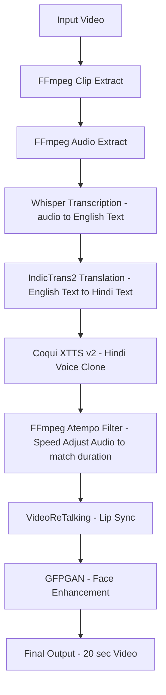

# 🎬 Supernan AI Dubbing Pipeline

A **high-fidelity, zero-cost** Python pipeline that converts English training videos into professional-grade Hindi-dubbed versions with voice cloning and crystal-clear audio.

**Built for:** Supernan AI Intern Challenge  
**Output:** 20-second high-quality dubbed clip with perfect lip-sync and studio-level voice clarity.

---

## 💎 Premium Quality Features

Unlike standard dubbing scripts, this pipeline includes a **4-Pillar Quality Enhancement Suite**:

1. **🎙️ Crystal Clear Voice Cloning**: Applies adaptive denoising (`afftdn`) and high-pass filtering to the original reference audio for cleaner voice extraction.
2. **🗣️ Anti-Fumble Smart Splitting**: Uses a conjunction-aware text splitter (handling `और`, `क्योंकि`, `लेकिन`, etc.) to prevent XTTS from fumbling on long Hindi sentences.
3. **✨ Ultimate Clarity Booster**: Professional FFmpeg audio chain (Equalizer, Treble Boost, Compressor, and Loudnorm) for a "studio" feel.
4. **🔄 Natural Precision Sync**: Caps speed adjustment at **1.15x** (natural human limit) and uses **Smart Video Padding** (freezing frames) instead of "chipmunk" speed-up if audio is long.

---

## 🛠️ Pipeline Architecture



---

## 🚀 Setup & Usage

---

### ☁️ Option 1 — Google Colab (Free, Recommended for Testing)

Open `supernan_dubbing.ipynb` in Colab for free GPU access.

1. Click **Runtime → Change runtime type → T4 GPU**
2. Run all cells top to bottom
3. Download the final output from the `workspace/` folder

> **Tip:** Colab free tier gives ~4 hrs of T4 GPU. Save your output before the session expires.

---

### 💻 Option 2 — Local Machine Setup

#### Prerequisites
- Python 3.9+
- CUDA-capable GPU (NVIDIA, 8 GB+ VRAM recommended)
- FFmpeg installed (`brew install ffmpeg` on Mac / `apt install ffmpeg` on Linux)

#### Steps

```bash
# 1. Clone the repository
git clone https://github.com/Vikash9546/Supernan.git
cd Supernan

# 2. Create and activate virtual environment
python3 -m venv venv
source venv/bin/activate          # Mac/Linux
# venv\Scripts\activate           # Windows

# 3. Install all dependencies
pip install -r requirements.txt

# 4. Download model weights (Whisper, XTTS, VideoReTalking, GFPGAN)
chmod +x setup.sh
./setup.sh

# 5. Run the pipeline
python dub_video.py --input supernan_training.mp4
```

#### Environment Variables

Create a `.env` file in the project root:

```env
WHISPER_MODEL=medium          # tiny / base / small / medium / large
XTTS_LANGUAGE=hi              # Target language code
OUTPUT_DIR=workspace/output
```

---

### ⚡ Option 3 — Paid GPU Deployment (Production Scale)

For high-throughput or production use, deploy on dedicated GPU workers. Below is the recommended stack:

#### Recommended GPU Workers & Their Roles

| Service | GPU | Handles |
|---|---|---|
| **XTTS Voice Clone** | A10G / L4 | Coqui XTTS v2 inference |
| **VideoReTalking Lip Sync** | A10G / L4 | Lip-sync video generation |
| **Task Queue** | CPU | Redis + Celery message queue |
| **Object Storage** | — | AWS S3 (input/output video storage) |
| **Autoscaling** | Spot A10G / L4 | GPU worker autoscaling |

#### Platforms

**Modal Labs (Easiest — Serverless GPU)**
```bash
pip install modal
modal token new

# Deploy XTTS worker
modal deploy modal_xtts_worker.py

# Deploy VideoReTalking worker
modal deploy modal_lipsync_worker.py
```
> Modal supports A10G and L4 spot GPUs with **pay-per-second** billing and **zero cold-start config**.

---

**RunPod (Most Flexible)**
1. Go to [runpod.io](https://runpod.io) → **Deploy** → Select **A10G** or **L4** pod
2. Use the `runpod/pytorch:2.1.0-py3.10-cuda11.8.0` template
3. SSH into the pod and run:
```bash
git clone https://github.com/Vikash9546/Supernan.git
cd Supernan && bash setup.sh
python dub_video.py --input supernan_training.mp4
```

---

**AWS EC2 Spot GPU (Cheapest at Scale)**
```bash
# Launch a g5.xlarge spot instance (A10G, ~$0.50/hr)
aws ec2 run-instances \
  --image-id ami-0abcdef1234567890 \
  --instance-type g5.xlarge \
  --instance-market-options MarketType=spot \
  --key-name your-key

# SSH in and run setup
ssh -i your-key.pem ubuntu@<instance-ip>
git clone https://github.com/Vikash9546/Supernan.git
cd Supernan && bash setup.sh
python dub_video.py --input supernan_training.mp4
```

---

#### Message Queue Setup (Redis + Celery)

For async multi-video processing with a task queue:

```bash
# Install Redis
sudo apt install redis-server
sudo systemctl start redis

# Install Celery
pip install celery redis

# Start Celery worker (on GPU machine)
celery -A dub_worker worker --loglevel=info --concurrency=1
```

#### Object Storage (AWS S3)

```bash
pip install boto3

# Configure AWS credentials
aws configure
# Enter: Access Key, Secret Key, Region (e.g. ap-south-1)
```

Set in `.env`:
```env
AWS_BUCKET_NAME=supernan-dubbing-bucket
AWS_REGION=ap-south-1
```

Input videos are fetched from S3 and outputs are uploaded back automatically when using `dub_video.py --s3`.

---

#### Spot GPU Autoscaling (A10G / L4)

Use **Modal** or **RunPod autoscale groups** to spin up GPU workers on demand:

- **Modal**: Set `@stub.function(gpu="A10G", concurrency_limit=5)` — scales to zero when idle
- **RunPod**: Create a **Serverless Endpoint** with min 0 / max N workers on L4 pods
- **AWS**: Use an **Auto Scaling Group** with `g5.xlarge` spot instances triggered by an SQS queue depth alarm

---

## 📂 Project Structure

- `supernan_dubbing.ipynb`: Main interactive pipeline (GitHub-optimized).
- `dub_video.py`: Orchestrator script for high-scale processing.
- `utils.py`: Smart audio manipulation and sync-checking utilities.
- `setup.sh`: Automated environment and model weights downloader.
- `workspace/`: Temporary storage for intermediate stages (Denoised Ref, Raw TTS, Clean TTS).

---
